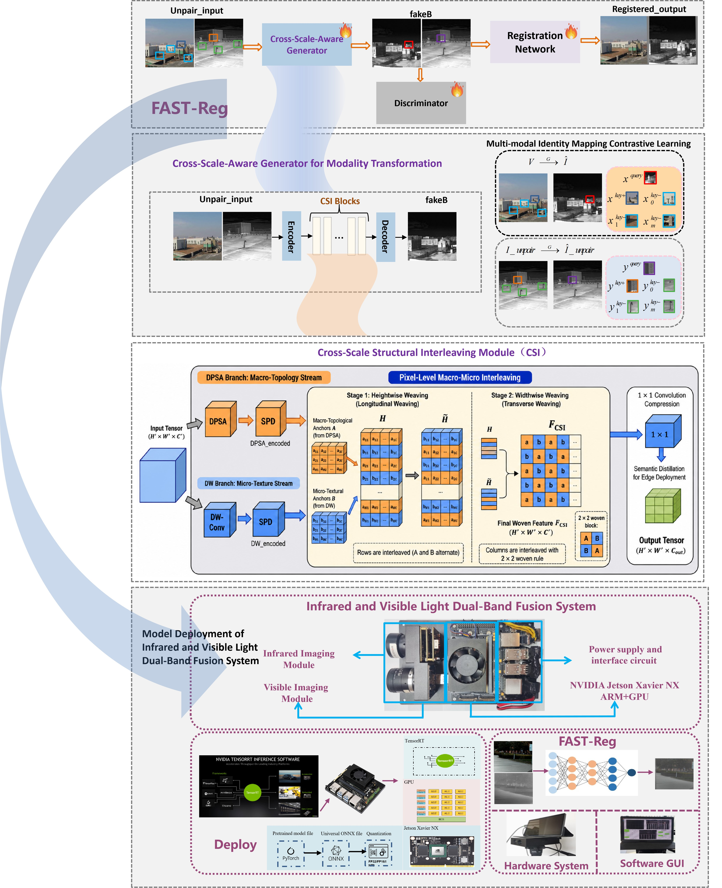

# FAST-Reg: Bridging the Cross-Scale Gap in Real-Time Registration via Scale-Aware Modality Translation

This is the official implementation of:

**FAST-Reg: Bridging the Cross-Scale Gap in Real-Time Registration via Scale-Aware Modality Translation**

FAST-Reg is an end-to-end, cross-scale-aware unsupervised framework for real-time infrared-visible image registration. It employs modality translation during training to reduce cross-modal appearance discrepancies while preserving reliable geometric structures across targets of different scales.

<p align="center">
  
</p>

<p align="center">
  <b>Graphical abstract of FAST-Reg.</b>
</p>

> **Current status:** This release currently provides the model definitions, pretrained weights, training records, and intermediate visualization results. Complete training, evaluation, visualization, and TensorRT deployment scripts are being organized and will be released progressively.

## Highlights

- **Cross-scale-aware infrared-visible registration:**  
  FAST-Reg is proposed as a cross-scale-aware infrared-visible image registration framework.

- **Cross-scale structure preservation:**  
  Macro-level topology and micro-level texture are interleaved by the Cross-Scale Structural Interleaving (CSI) module to preserve cross-scale structures.

- **Real-time edge deployment:**  
  The TensorRT-optimized FAST-Reg achieves real-time registration on a dual-band edge platform.

## Method Overview

FAST-Reg consists of three main components:

1. **Cross-Scale-Aware Modality Translation Network**

   The generator maps visible images into the infrared domain, reducing the appearance discrepancy between visible and infrared modalities.

2. **Cross-Scale Structural Interleaving Module**

   The CSI module contains two complementary branches:

   - A macro-topology branch for capturing long-range structural relationships;
   - A micro-texture branch for preserving local edges and fine-grained details.

   The features from the two branches are reorganized and spatially interleaved to preserve geometric cues across targets of different scales.

3. **Attention-Driven Registration Network**

   The registration network estimates the affine transformation parameters between the translated image and the reference infrared image.

During training, the generator, discriminator, and registration network are jointly optimized. During deployment, the modality translation branch is removed, and only the registration network is used for efficient affine transformation estimation.

## Repository Structure

```text
FAST-Reg
├── checkpoints
│   └── 004_01_A2B
│       ├── web
│       ├── best_net_D.pth
│       ├── best_net_F.pth
│       ├── best_net_G.pth
│       ├── best_net_R.pth
│       ├── latest_net_D.pth
│       ├── latest_net_F.pth
│       ├── latest_net_G.pth
│       ├── latest_net_R.pth
│       ├── loss_log.txt
│       ├── lossR_log.txt
│       └── train_opt.txt
├── models
├── .gitattributes
├── .gitignore
├── best_net_R.pth
├── graphical_abstract.jpg
└── README.md
```

## Pretrained Models

The repository currently provides the trained model checkpoints.

| File | Description |
| --- | --- |
| `best_net_R.pth` | Pretrained registration network for inference and deployment |
| `checkpoints/004_01_A2B/best_net_G.pth` | Best generator checkpoint |
| `checkpoints/004_01_A2B/best_net_D.pth` | Best discriminator checkpoint |
| `checkpoints/004_01_A2B/best_net_F.pth` | Best feature sampler checkpoint |
| `checkpoints/004_01_A2B/best_net_R.pth` | Best registration network checkpoint |
| `checkpoints/004_01_A2B/latest_net_*.pth` | Latest training checkpoints |

For edge deployment, only the registration model `best_net_R.pth` is required.

## Datasets

FAST-Reg is evaluated on two public infrared-visible datasets:

- **IRVI Dataset**
  - Rootfp subset
  - Traffic subset
- **VIVS Dataset**

The datasets are not included in this repository. Please download them from their official sources and organize them according to the corresponding training or evaluation configuration.

## Deployment Performance

FAST-Reg adopts a training-deployment decoupling strategy. The modality translation network is used only during training, while the registration network is retained for real-time inference.

| Platform | Deployed Model | Inference Time | Performance |
| --- | --- | ---: | ---: |
| NVIDIA RTX A6000 | Model R | 1.04 ms | 94.8% inference speed-up |
| NVIDIA Jetson Xavier NX | Model R | 6.64 ms | 150 FPS |

## Current Release

The current release provides:

- Model definitions for modality translation and image registration;
- Pretrained registration weights for inference and deployment;
- Generator, discriminator, feature sampler, and registration checkpoints;
- Training configurations, loss logs, and intermediate visualization results.

The remaining training, evaluation, visualization, and TensorRT deployment scripts are currently being organized and verified. They will be released progressively.

## Acknowledgements

This repository is developed based on several excellent multimodal registration and image-to-image translation frameworks, including NeMAR, CUT, CycleGAN, and pix2pix. We sincerely thank the authors for their outstanding work.

<details>
<summary><b>Reference BibTeX</b></summary>

### NeMAR

```bibtex
@inproceedings{Arar_2020_CVPR,
  author    = {Arar, Moab and Ginger, Yiftach and Danon, Dov and Bermano, Amit H. and Cohen-Or, Daniel},
  title     = {Unsupervised Multi-Modal Image Registration via Geometry Preserving Image-to-Image Translation},
  booktitle = {Proceedings of the IEEE/CVF Conference on Computer Vision and Pattern Recognition},
  month     = {June},
  year      = {2020}
}
```

### CUT

```bibtex
@inproceedings{park2020contrastive,
  title     = {Contrastive Learning for Unpaired Image-to-Image Translation},
  author    = {Park, Taesung and Efros, Alexei A. and Zhang, Richard and Zhu, Jun-Yan},
  booktitle = {European Conference on Computer Vision},
  pages     = {319--345},
  year      = {2020}
}
```

### CycleGAN

```bibtex
@inproceedings{zhu2017unpaired,
  title     = {Unpaired Image-to-Image Translation Using Cycle-Consistent Adversarial Networks},
  author    = {Zhu, Jun-Yan and Park, Taesung and Isola, Phillip and Efros, Alexei A.},
  booktitle = {Proceedings of the IEEE International Conference on Computer Vision},
  year      = {2017}
}
```

### pix2pix

```bibtex
@inproceedings{isola2017image,
  title     = {Image-to-Image Translation with Conditional Adversarial Networks},
  author    = {Isola, Phillip and Zhu, Jun-Yan and Zhou, Tinghui and Efros, Alexei A.},
  booktitle = {Proceedings of the IEEE Conference on Computer Vision and Pattern Recognition},
  year      = {2017}
}
```

</details>
